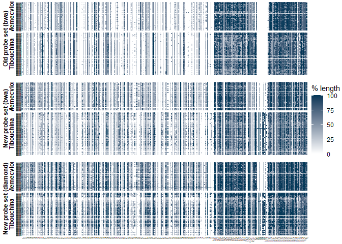
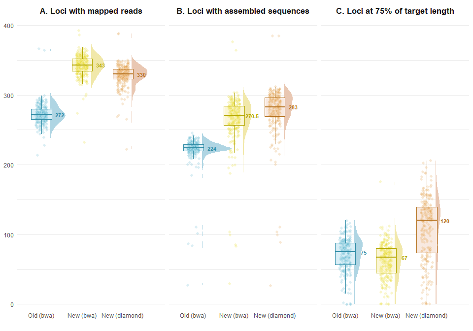

Sequence recovery comparison between the old and new probe sets
================

To measure the performance of the new probe set, we run three different
assemblies of the targeted loci:

1)  with the *old* probe set in *nucleotide* format
2)  with the *new* probe set in *nucleotide* format
3)  with the *new* probe set in *amino-acids* format (i.e. translated
    nucleotides)

To do so, we use:

- Samples: 144 *Tibouchina* and 96 *Memecylon* samples from Jantzen et
  al. (2020): NCBI BioProject numbers
  [PRJNA573947](https://www.ncbi.nlm.nih.gov/bioproject/PRJNA573947) and
  [PRJNA576018](https://www.ncbi.nlm.nih.gov/bioproject/PRJNA576018)
- HybPiper 2.1.1 with BWA (when probe set is in nucleotide format) or
  Diamond (when probe set in amino-acid format) fo reads mapping

## Retrieve data from NCBI

``` bash
cd $path_to_wd
mkdir Probe_set_comparison
cd Probe_set_comparison
```

Configure SRA Toolkit to set `$path_to_wd/Probe_set_comparison` as
default directory with the following command:

``` bash
vdb-config -i
```

Download from NCBI the accession lists in .csv:
SraAccList_Tibouchina.csv and SraAccList_Memecylon.csv. Place the files
in `$path_to_wd/Probe_set_comparison`.

Prefetch:

``` bash
cd $path_to_wd/Probe_set_comparison
prefetch --option-file SraAccList_Tibouchina.csv
prefetch --option-file SraAccList_Memecylon.csv
```

Extract .fastq in 2 paired reads file and 1 unpaired file per sample.

``` bash
mkdir fastq
fastq-dump ./sra/*.sra -O fastq --split-3
```

## Prepare the old probe set

The old probe set was retrieved from the original publication but cannot
be used as it is.

``` bash
cd $path_to_wd/original_template_sequences/Template_sequences
cat *.fasta | sed '/^>/!s/-//g' | sed '/^>/!s/[^ATGCNatgcn]//g' | sed -E '/^>/s/(\w*\.*\w*)-(\w*\.*\w*)/\2-\1/' > ../Old_probe_set.fasta
cd ../
dos2unix Old_probe_set.fasta
cat Old_probe_set.fasta | seqkit replace -p 'Tibouchina-KT377070$' -r 'Tibouchina2-KT377070.1' | seqkit replace -p 'KT377070$' -r 'KT377070.1' | seqkit replace -p 'KT377086$' -r 'KT377086.1' | seqkit replace -p 'KT377086$' -r 'KT377086.1' | seqkit replace -p 'KT377102$' -r 'KT377102.1' | seqkit replace -w0 -p 'KT377110$' -r 'KT377110.1' > Old_probe_set_384.fasta
cat Old_probe_set_384.fasta | seqkit seq -n | sed 's/.*-//g' | sort | uniq | wc -l
```

## HybPiper 2.1.1

### Assemble

Create a [`namelist.txt`]() file with all the samples names (accession
names).

#### BWA old probe set

See sbatch script
[`hybpiper2_assemble_COMP_bwa_old.sh`](Probe_set_comparison/hybpiper2_assemble_COMP_bwa_old.sh).

``` bash
cd $path_to_wd/Probe_set_comparison
sbatch hybpiper2_assemble_COMP_bwa_old.sh
```

#### BWA new probe set

See sbatch script
[`hybpiper2_assemble_COMP_bwa_new.sh`](Probe_set_comparison/hybpiper2_assemble_COMP_bwa_new.sh).

``` bash
cd $path_to_wd/Probe_set_comparison
sbatch hybpiper2_assemble_COMP_bwa_new.sh
```

#### Diamond new probe set

See sbatch script
[`hybpiper2_assemble_COMP_diamond_new.sh`](Probe_set_comparison/hybpiper2_assemble_COMP_diamond_new.sh).

``` bash
cd $path_to_wd/Probe_set_comparison
sbatch hybpiper2_assemble_COMP_diamond_new.sh
```

### Combined heatmap

``` r
library(readr)
library(tidyverse)
library(ggh4x)
# path_to_jobs="$path_to_wd/Probe_set_comparison"
path_to_jobs <- "Probe_set_comparison"
path_to_out <- "Probe_set_comparison/"
bwa_old <- read_tsv(file = paste(path_to_jobs, "Probe_set_comparison_hybpiper2_assemble_no_stiched_bwa_old_66557934", "genes_sequences_lengths.tsv", sep = "/")) %>% pivot_longer(cols = c(-1), names_to = "locus", values_to = "length") %>% mutate(percentage = length / length[which(Species == "MeanLength")])
bwa_new <- read_tsv(file = paste(path_to_jobs, "Probe_set_comparison_hybpiper2_assemble_no_stiched_bwa_new_66464267", "genes_sequences_lengths.tsv", sep = "/")) %>% pivot_longer(cols = c(-1), names_to = "locus", values_to = "length") %>% mutate(percentage = length / length[which(Species == "MeanLength")])
diamond_new <- read_tsv(file = paste(path_to_jobs, "Probe_set_comparison_hybpiper2_assemble_no_stiched_diamond_new_66820939", "genes_sequences_lengths.tsv", sep = "/")) %>% pivot_longer(cols = c(-1), names_to = "locus", values_to = "length") %>% mutate(percentage = length / length[which(Species == "MeanLength")])
Tibouchina <- read_csv(file = paste(path_to_jobs, "SraAccList_Tibouchina.csv", sep = "/")) %>% pull(acc)
Memecylon <- read_csv(file = paste(path_to_jobs, "SraAccList_Memecylon.csv", sep = "/")) %>% pull(acc)

combined <- bind_rows("1bwa_old" = bwa_old, "2bwa_new" = bwa_new, "3diamond_new" = diamond_new, .id = "id") %>% mutate(percentage = if_else(percentage > 1, 1, percentage)) %>% filter(Species != "MeanLength") %>% mutate(Genus = if_else(Species %in% Tibouchina, "Tibouchina", "Memecylon"))

heatmap <- ggplot(data = combined[,], aes(x = locus, y = Species, fill = percentage))+
  geom_tile()+
  facet_nested(vars(id, Genus), drop = T, scale = "free_y", space = "free_y", switch = "y", labeller = as_labeller(c(`1bwa_old` = "Old probe set (bwa)", `2bwa_new` = "New probe set (bwa)", `3diamond_new` = "New probe set (diamond)", Tibouchina = "Tibouchina", Memecylon = "Memecylon")))+
  scale_fill_gradient(low="#ffffff", high = "#023858", name = "% length", breaks = c(0,0.25,0.5, 0.75 ,1), labels = c("0","25", "50", "75", "100"))+
  theme_void()+
  theme(strip.text = element_text(face ='bold', angle = 90),
        strip.placement = "outside",
        # strip.background = element_rect(color = "black"),
        axis.title.y = element_blank(),
        axis.text.y = element_text(size = 1),
        axis.text.x = element_text(angle = 45, size = 1, hjust = 1, vjust = 0.95),
        panel.spacing.y = unit(c(3,10,3,10,3), "points"),
        plot.margin = unit(c(3,3,3,3), "points")
        )
ggsave(plot = heatmap, filename = paste0(path_to_out,"heatmap_recovery_combined.pdf"), width = 30, height = 30, units = "cm")

heatmap
```

<!-- -->

[**Figure 1**](Probe_set_comparison/heatmap_recovery_combined.pdf).
Percentage length recovery for each locus and each sample, relative to
the mean length of the reference.

### Recovery statistics

``` r
library(readr)
library(tidyverse)
path_to_jobs <- "Probe_set_comparison"
path_to_out <- "Probe_set_comparison/"
bwa_old_stats <- read_tsv(file = paste(path_to_jobs, "Probe_set_comparison_hybpiper2_assemble_no_stiched_bwa_old_66557934", "hybpiper_genes_statistics.tsv", sep = "/"))
bwa_new_stats <- read_tsv(file = paste(path_to_jobs, "Probe_set_comparison_hybpiper2_assemble_no_stiched_bwa_new_66464267", "hybpiper_genes_statistics.tsv", sep = "/"))
diamond_new_stats <- read_tsv(file = paste(path_to_jobs, "Probe_set_comparison_hybpiper2_assemble_no_stiched_diamond_new_66820939", "hybpiper_genes_statistics.tsv", sep = "/")) 

combined_stats <- bind_rows("bwa_old" = bwa_old_stats, "bwa_new" = bwa_new_stats, "diamond_new" = diamond_new_stats, .id = "id") %>% mutate(Genus = if_else(Name %in% Tibouchina, "Tibouchina", "Memecylon"), .before = Name)

# combined_stats %>%
# group_by(id) %>% summarise_at(.vars = vars(NumReads,ReadsMapped,PctOnTarget,GenesMapped,GenesWithContigs,GenesWithSeqs,GenesAt25pct,GenesAt50pct,GenesAt75pct,GenesAt150pct), .funs = list(avg= mean, med = median, sd = sd))

summary_combined_stats <- combined_stats %>%
group_by(id) %>% summarise_if(.predicate = is.double, .funs = list(avg=mean, med = median, sd=sd))
write_tsv(summary_combined_stats, file = paste0(path_to_out, "summary_combined_stats.tsv"))
```

#### Plot

``` r
combined_stats_for_gg <- combined_stats %>% select(id,Genus,Name,GenesMapped,GenesWithSeqs,GenesAt75pct)%>% pivot_longer(cols = c(GenesMapped,GenesWithSeqs,GenesAt75pct), names_to = "variable")

library(ggdist)
library(gghalves)
library(wesanderson)
library(colorspace)

colpal = c(bwa_old = "#46ACC8", bwa_new = "#E2D200", diamond_new = "#DD8D29")

statplot <- ggplot(combined_stats_for_gg, aes(x = id, y = value))+
  ## half-violin from {ggdist} package
  stat_halfeye(
    aes(color = id,
        fill = after_scale(desaturate(lighten(color, .5), .5))),
               adjust = 1,
               justification = -.3,
               width = .8,
               .width = 0,
               point_colour = NA
               ) +
  ## boxplot
   geom_boxplot(
     aes(color = id,
         color = after_scale(darken(color, .1, space = "HLS")),
         fill = after_scale(desaturate(lighten(color, .8), .4))),
     width = .5,
     outlier.color = NA,
    )+
  ## points
    geom_point(aes(fill = id),
    color = "transparent",
    shape = 21,
    stroke = .4,
    size = 2,
    alpha = .2,
    position = position_jitter(seed = 1, width = .14)
    )+
  ## boxplot
   geom_boxplot(
     aes(color = id,
         color = after_scale(darken(color, .2, space = "HLS"))),
         fill = "transparent",
     width = .5,
     outlier.color = NA,
    )+
  ## text
 stat_summary(
    geom = "text",
    fun = "median",
    aes(label = round(..y.., 2),
        color = id,
        color = after_scale(darken(color, .2, space = "HLS"))),
    fontface = "bold",
    size = 3,
    position = position_nudge(x=.45)
    ) +
  
  facet_grid(.~factor(variable, levels = c('GenesMapped', 'GenesWithSeqs', 'GenesAt75pct')), labeller = as_labeller(c(GenesMapped = "A. Loci with mapped reads", GenesWithSeqs = "B. Loci with assembled sequences", GenesAt75pct = "C. Loci at 75% of target length")))+
  
  scale_fill_manual(values = colpal, guide = 'none')+
  scale_color_manual(values = colpal, guide = 'none')+
  scale_x_discrete(limits = c("bwa_old", "bwa_new", "diamond_new"), labels = c(bwa_old = "Old (bwa)", bwa_new = "New (bwa)", diamond_new = "New (diamond)"))+
  theme_minimal()+
  theme(strip.text = element_text(face = "bold", size = 13),
        panel.grid.major.x = element_blank(),
        axis.text.x = element_text(vjust = 10),
        axis.title = element_blank()
        )
ggsave(plot = statplot, filename = paste0(path_to_out,"statistics.pdf"), height = 16.7, width = 25, units = "cm", dpi = 300)
statplot
```

<!-- -->

[**Figure 2**](Probe_set_comparison/statistics.pdf). Summary of recovery
statistics computed with HybPiper for the assemblies with the old probe
set (blue) and the new probe set in nucleotide format (yellow), and with
the new probe set in amino-acids format (orange). **A**: number of loci
with mapped reads, **B**: number of loci with assembled sequences, and
**C**: number of loci with assembled sequences equal or longer to 75% of
the length of their locus reference in the probe set. Burrow-Wheeler
aligner (bwa) was used to map the reads with nucleotide probe sets, and
Diamond was used for the amino-acids probe set. Numbers right to the
boxplots are the median value.
